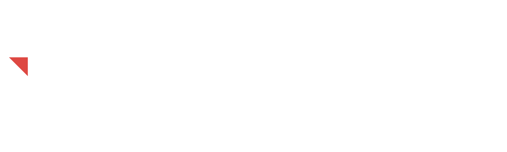

# Techno Digital Twin Stack

<p align="center">
  <a href="https://technostacks.com">
    
  </a>
</p>

## Industrial-Grade Digital Twin Platform

**Techno Digital Twin Stack** is an enterprise digital twin platform for real-time monitoring, simulation, and optimization of physical assets. Built on proven 3D engine technology, it provides comprehensive solutions for Industry 4.0 and digital transformation initiatives.

### Key Capabilities

- **Real-Time IoT Integration**: Connect industrial equipment via MQTT, OPC-UA, and REST APIs
- **Physics-Based Simulation**: Validate designs and processes before physical implementation
- **AI-Powered Analytics**: Predictive maintenance, anomaly detection, and performance optimization
- **3D Visualization**: Immersive representation of physical assets and manufacturing processes
- **Cross-Platform Deployment**: Desktop (Windows, Linux, macOS), Web (WebGL/WebGPU), and Cloud

### Three-Tier Digital Twin Architecture

Following industry-leading approaches (Siemens, Tesla), TDT Stack implements:

1. **Product Twin**: Design, simulate, and verify products virtually before manufacturing
2. **Production Twin**: Optimize manufacturing processes through virtual commissioning
3. **Performance Twin**: Monitor operational assets in real-time with predictive intelligence

## Target Industries

- **Manufacturing**: Assembly line optimization, quality control, predictive maintenance
- **Energy**: Wind turbines, solar farms, grid infrastructure monitoring
- **Automotive**: Production simulation, supply chain visibility
- **Smart Buildings**: HVAC optimization, energy management, occupancy analytics
- **Industrial Automation**: Robot programming, PLC integration, process control

## Getting Started

### Prerequisites

- **C++ Compiler**: GCC 13+, Clang 16+, or MSVC 2022+
- **Python 3.8+**: For build system (SCons)
- **Git**: Version control

### Building from Source

```bash
# Clone the repository
git clone https://github.com/rishimehta03/TS-DigitalTwin.git
cd TS-DigitalTwin

# Install dependencies
python -m pip install scons

# Build the digital twin platform (Windows example)
scons platform=windows target=editor

# Run the editor
.\bin\tdtstack.windows.editor.x86_64.exe
```

For detailed compilation instructions for all platforms, see [Building TDT Stack](https://technostacks.com/tdt-stack/docs/building).

## Documentation

- **Getting Started Guide**: [technostacks.com/tdt-stack/docs/getting-started](https://technostacks.com/tdt-stack/docs/getting-started)
- **API Reference**: [technostacks.com/tdt-stack/docs/api](https://technostacks.com/tdt-stack/docs/api)
- **Tutorials**: [technostacks.com/tdt-stack/docs/tutorials](https://technostacks.com/tdt-stack/docs/tutorials)
- **Use Case Examples**: See the `examples/` directory

## Community and Support

- **Technical Support**: [technostacks.com/support](https://technostacks.com/support)
- **Bug Reports**: [GitHub Issues](https://github.com/rishimehta03/TS-DigitalTwin/issues)
- **Feature Requests**: [GitHub Discussions](https://github.com/rishimehta03/TS-DigitalTwin/discussions)

## Contributing

We welcome contributions! Please see:
- [CONTRIBUTING.md](CONTRIBUTING.md) - Contribution guidelines
- [BRANDING.md](BRANDING.md) - Branding and naming conventions

## License

Techno Digital Twin Stack is licensed under the MIT License. See [LICENSE.txt](LICENSE.txt) for details.

### Third-Party Software

This software is built upon **Godot Engine** (https://godotengine.org), which is also licensed under the MIT License.
- Copyright © 2014-present Godot Engine contributors
- See [COPYRIGHT.txt](COPYRIGHT.txt) for complete copyright information

## About Technostacks

**Technostacks Infotech Private Limited** is a leading technology consulting company specializing in AI, IoT, ERP, and digital transformation solutions. We help businesses turn challenges into opportunities through innovative technology.

Learn more at [technostacks.com](https://technostacks.com)

---

*Powered by modified Godot Engine technology*

